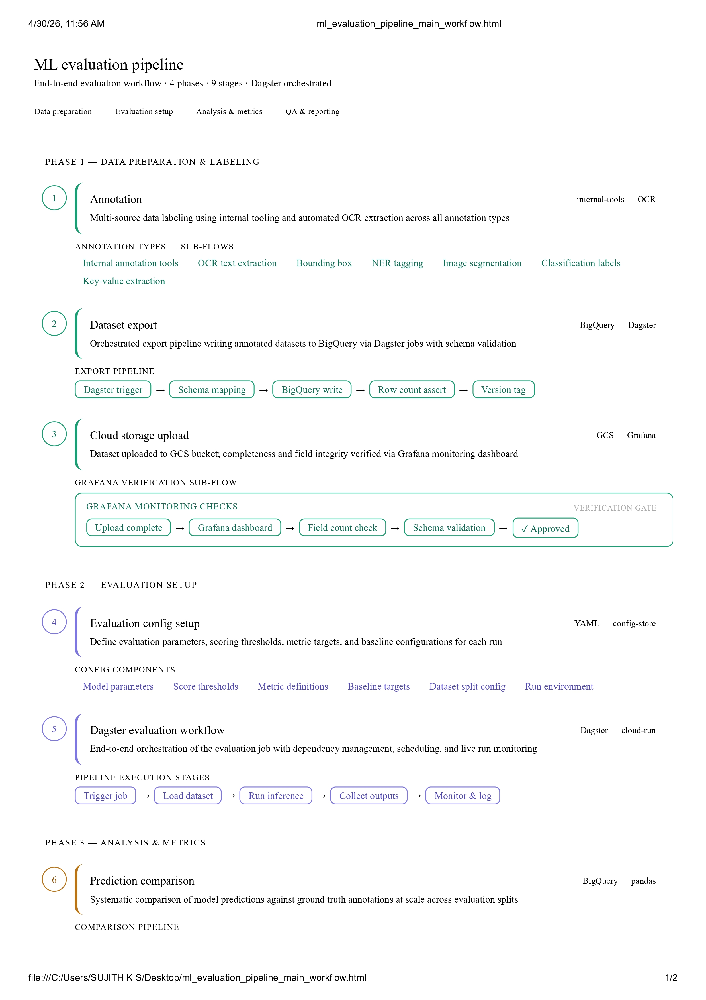

# ML Evaluation Workflows & Annotation QA

## Overview

This repository showcases realistic ML evaluation workflows, annotation QA operations, and dataset validation processes used in AI document intelligence and OCR evaluation pipelines.

The project demonstrates:
- annotation export workflows
- cloud-based dataset handling
- configurable evaluation pipelines
- metrics analysis
- model comparison
- annotation quality review
- AI workflow operations

---

# End-to-End Workflow

```text
CVAT Annotation
      ↓
Dataset Export
      ↓
Cloud Project Upload
      ↓
Evaluation Configuration
      ↓
Evaluation Script Execution
      ↓
Metrics Generation
      ↓
QA Analysis & Reporting
```
# Workflow Architecture


---

# Core Areas Covered

## ML Evaluation
- Accuracy analysis
- Precision & recall review
- F1 score comparison
- Classification validation
- OCR extraction evaluation
- Model comparison workflows

---

## Annotation QA
- Missing annotation review
- Boundary consistency validation
- OCR extraction quality checks
- Edge case analysis
- Dataset quality auditing

---

## Workflow Operations
- Dataset export handling
- Cloud project organization
- Evaluation configuration setup
- Evaluation pipeline execution
- Metrics reporting workflows

---

# Simulated Workflow Environment

This project simulates realistic AI/ML evaluation operations workflows inspired by production-oriented annotation and OCR evaluation systems.

The repository focuses on operational understanding rather than model training implementation.

---

# Tools & Platforms

- CVAT
- Excel / CSV workflows
- YAML configurations
- OCR evaluation workflows
- Annotation QA process
- Dataset validation operations

---

# Repository Structure

# Project Navigation

| Section | Description |
|---|---|
| dataset | Ground truth and model prediction datasets |
| evaluation-configs | YAML evaluation configuration files |
| evaluation-scripts | Model evaluation and comparison scripts |
| metrics-analysis | Metrics reports and evaluation summaries |
| annotation-qa | Annotation quality analysis and QA review |
| workflow-diagrams | End-to-end workflow architecture |
| sample-reports | Final evaluation comparison reports |
| cloud-workflow | Simulated cloud project structure |
| screenshots | Evaluation workflow screenshots |

---

# Use Cases

- OCR evaluation
- Logistics document validation
- AI dataset QA
- Annotation quality review
- Model prediction analysis
- ML workflow operations

------

# Evaluation Metrics

This project includes evaluation workflows for:

- Accuracy
- Precision
- Recall
- F1 Score
- OCR extraction quality
- Annotation consistency validation
- Prediction mismatch analysis
- Classification evaluation

---

# Model Evaluation Workflow

The repository simulates comparison between:
- Model V1 (baseline OCR extraction model)
- Model V2 (improved fine-tuned extraction model)

Predictions are evaluated against ground truth datasets to analyze:
- extraction accuracy
- formatting consistency
- OCR normalization quality
- annotation-related performance impact

---

# Sample Evaluation Workflow

```text
Ground Truth Dataset
        ↓
Model V1 Predictions
        ↓
Model V2 Predictions
        ↓
Prediction Comparison
        ↓
Metrics Calculation
        ↓
Mismatch Analysis
        ↓
QA Validation
        ↓
Final Evaluation Report
```

---

# Key Evaluation Features

- OCR extraction comparison
- Prediction mismatch analysis
- Annotation quality validation
- Metrics-based model comparison
- YAML-based evaluation configuration
- Simulated cloud workflow handling
- Structured QA review process

---

# Disclaimer

This repository is a simulated portfolio project designed to demonstrate realistic ML evaluation workflows, annotation QA operations, and OCR evaluation processes inspired by production-oriented AI data operations environments.

No confidential production systems, proprietary pipelines, or customer data are included.

---
⭐ Focused on AI data quality, ML evaluation operations, and annotation QA workflows.
